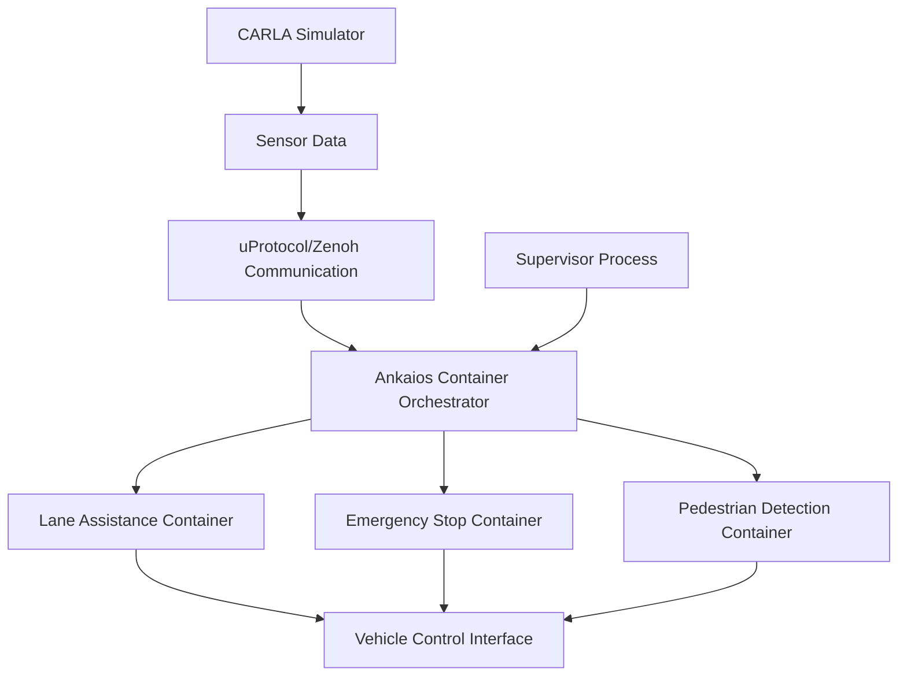

# Team RT-RK Solution Plan

# 1. Your Team at a Glance

## Team Name / Tagline  
**RT-RK Innovation Squad** - *"Driving the Future of Connected Mobility"*

## Team Members  
| Name | GitHub Handle | Role(s) |
|-------|---------------|---------|
| Sachin Kumar | @sachinkum0009 | Embedded systems |
| Luka Radovic | @r4d0v1c | Computer Vision |
| Vuk Pavic | @Vulpes107 | System Architecture |
| Blagoje Milosevic | @bagi002 | Algorithms |
| Petar Resetar | @resetarp | Dashboard Development |

## Challenge  
**Eclipse SDV Hackathon Chapter Three** - SDV Lab Challenge

## Core Idea  
Our solution builds a comprehensive Software Defined Vehicle (SDV) platform that demonstrates advanced ADAS capabilities through a modular, container-based architecture.

### Architecture Overview
- **Simulation Foundation**: CARLA simulator provides realistic driving scenarios and sensor data
- **Container Orchestration**: Ankaios manages containerized workloads on embedded systems
- **Communication Layer**: uProtocol for inter-container communication, with Zenoh for high-bandwidth, low-latency data streams
- **Intelligent Supervision**: Supervisor process dynamically spawns controllers based on driving conditions and requirements
- **Modular Design**: Independent containerized workloads for each ADAS feature

### ADAS Features Implementation
1. **Lane Keeping Assistance**
   - Camera-based lane detection using computer vision algorithms
   - Real-time image processing for lane boundary identification
   
2. **Emergency Braking System**
   - Radar-based obstacle detection and collision avoidance
   - Automatic emergency stop when collision risk is detected
   
3. **Pedestrian Detection & Safety**
   - Camera-based object detection for pedestrian identification
   - Alert and avoidance mechanisms for enhanced safety

# 2. How Do You Work

## Development Process  
We follow an agile development approach with rapid prototyping and iterative improvements. Our process emphasizes collaboration, quick feedback loops, and continuous integration.

### Planning & Tracking  
- **Project Management**: GitHub Projects for task tracking and sprint planning
- **Dynamic sync**: Quick sync meetings to discuss progress and blockers when needed
- **Documentation**: Continuous documentation in markdown files and code comments

### Quality Assurance  
- **Code Reviews**: All code changes require peer review before merging
- **Testing Strategy**: Unit tests, and manual testing in Carla simulator
- **Documentation Standards**: Comprehensive README files and API documentation

## Communication  
- **Primary Channel**: WhatsApp group chat for real-time communication
- **Progress Updates**: Regular updates in team chat and project board

## Decision Making  
- **Consensus Building**: Technical decisions made through team discussion
- **Lead Consultation**: Major architectural decisions reviewed by team
- **Documentation**: All decisions documented with reasoning
- **Rapid Response**: Quick decision-making for time-sensitive issues during hackathon